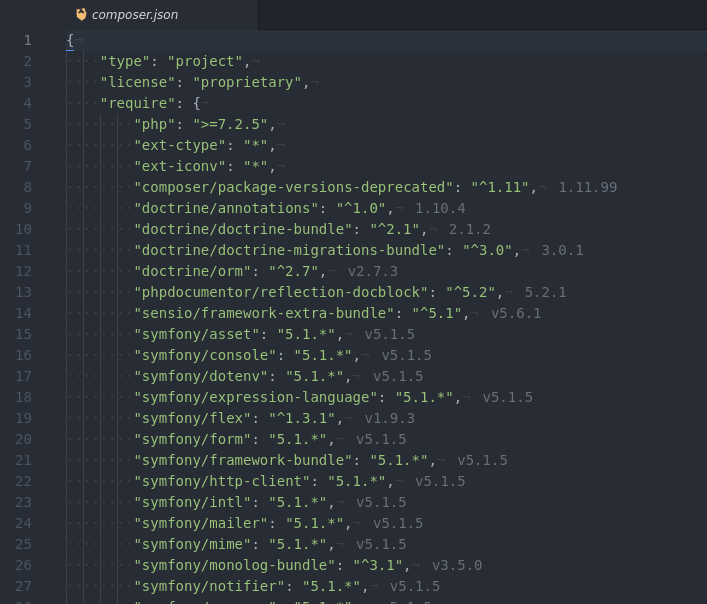

# Lock File Version Display

This package will read the contents of your lock file and display relevant version information in associated files.

Currently supports composer (`composer.json` / `composer.lock`). Future plans exist to support Node (`package.json` / `package-lock.json`).

